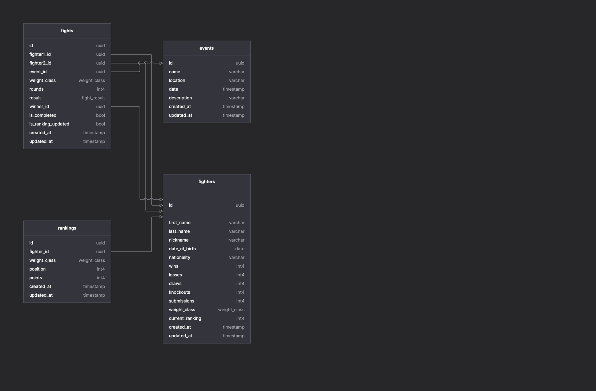

# MMA Platform API

## Description

This is a NestJS-based API for managing MMA fighters, events, fights, and rankings. The application follows Clean Architecture principles and provides a GraphQL API for interacting with the platform.

## Features

- Fighter management (profiles, statistics, fight history)
- Event scheduling and management
- Fight results tracking and recording
- Automated ranking calculations based on fight outcomes
- Background processing for ranking updates
- Comprehensive GraphQL API

## Tech Stack

- NestJS (v11)
- TypeORM
- PostgreSQL
- GraphQL
- Apollo Server
- Node.js (v14 or later)

## Prerequisites

- Node.js (v14 or later)
- PostgreSQL (v12 or later)
- npm, yarn, or pnpm

## Installation

### Option 1: Standard Setup

1. Clone the repository:
```bash
git clone <repository-url>
cd mma-platform-nestjs
```

2. Install dependencies:
```bash
pnpm install
# or
npm install
# or
yarn install
```

3. Configure the database:
   - Create a PostgreSQL database
   - Create a `.env` file in the root directory with the following variables:
   ```
   # Database Configuration
   DB_HOST=localhost
   DB_PORT=5432
   DB_USERNAME=postgres
   DB_PASSWORD=your_password
   DB_DATABASE=mma_platform
   
   # Application Configuration
   PORT=3000
   NODE_ENV=development
   ```

4. Set up the database:
```bash
# Create the database
createdb mma_platform

# Run the initialization scripts
psql -d mma_platform -f database/migrations/00-init-extensions.sql
psql -d mma_platform -f database/migrations/initial-schema.sql
```

### Option 2: Using Docker Compose

The project includes a `docker-compose.yml` file that sets up both the API and PostgreSQL database:

```bash
# For development, you can start just the database service
docker compose up -d postgres

# The initialization scripts will be automatically executed via the volume mount
# specified in the docker-compose.yml file

# Alternatively, build and start the complete application (API + PostgreSQL)
docker compose up --build
```

## Running the Application

```bash
# development mode
pnpm start:dev
# or
npm run start:dev
# or
yarn start:dev

# production mode
pnpm start:prod
# or
npm run start:prod
# or
yarn start:prod
```

The GraphQL API will be available at `http://localhost:3000/graphql`.

## Testing

```bash
# unit tests
pnpm test
# or
npm run test
# or
yarn test
```

## Project Structure

The project follows the Clean Architecture principles:

```
src/
├── common/             # Shared utilities and base classes
├── config/             # Application configuration
├── modules/            # Feature modules
│   ├── fighters/       # Fighter domain
│   │   ├── domain/     # Entities
│   │   ├── application/# Use cases and application services
│   │   └── infrastructure/ # Controllers, resolvers, repositories
│   ├── events/         # Event domain
│   ├── fights/         # Fight domain
│   └── rankings/       # Ranking domain
└── main.ts             # Application entry point
```

## Database Schema

The database schema is designed to support all the platform's features with proper relationships between entities:



The diagram shows the relationships between fighters, events, fights, and rankings.

## Ranking Algorithm

The platform uses a points-based ranking system to determine fighter positions within their respective weight classes:

1. **Points System**:
   - **Win via Knockout or Submission**: 4 points
   - **Win via Decision**: 3 points
   - **Draw**: 1 point
   - **Loss**: 0 points

2. **Ranking Calculation Process**:
   - Points are calculated based on fight results
   - Fighters are sorted by total points in descending order
   - Fighter records and rankings are automatically updated
   - Rankings are processed asynchronously in the background

3. **Tiebreaker Rules**:
   - Win Percentage: (wins / total fights) * 100
   - Recent Activity: More recent fight activity is prioritized

4. **Implementation Components**:
   - `RankingsService`: Handles finding and updating rankings
   - `RankingService`: Processes fight results and calculates points
   - `FightsService`: Triggers ranking updates when results are recorded
   - `RankingProcessorScheduler`: Runs background processing for rankings

## GraphQL API Usage

The MMA Platform provides a comprehensive GraphQL API. Here are some example queries and mutations:

### Fighters API

```graphql
# Query all fighters
query {
  fighters {
    id
    firstName
    lastName
    nickname
    dateOfBirth
    nationality
    wins
    losses
    draws
    knockouts
    submissions
    weightClass
    currentRanking
  }
}

# Query fighter by ID
query {
  fighter(id: "fighter-id-here") {
    id
    firstName
    lastName
    nickname
    # other fields...
  }
}

# Create a new fighter
mutation {
  createFighter(input: {
    firstName: "John"
    lastName: "Doe"
    nickname: "The Destroyer"
    dateOfBirth: "1990-01-01"
    nationality: "USA"
    weightClass: LIGHTWEIGHT
  }) {
    id
    firstName
    lastName
    nickname
  }
}
```

### Events API

```graphql
# Query all events
query {
  events {
    id
    name
    location
    date
    description
  }
}

# Query upcoming events with fight cards
query {
  upcomingEventsWithFights {
    id
    name
    location
    date
    description
    fights {
      id
      fighter1 {
        id
        firstName
        lastName
        nickname
      }
      fighter2 {
        id
        firstName
        lastName
        nickname
      }
      weightClass
      rounds
    }
  }
}
```

For more detailed API examples, refer to the `docs/api-usage.md` file.

## Deployment

### Production Deployment

1. Build the application:
```bash
pnpm build
# or
npm run build
# or
yarn build
```

2. Configure production environment variables in `.env.production`

3. Start the production server:
```bash
NODE_ENV=production pnpm start:prod
# or
NODE_ENV=production npm run start:prod
# or
NODE_ENV=production yarn start:prod
```

### Docker Deployment

The project includes a `docker-compose.yml` file for easy deployment:

```bash
# Build and start all services
docker compose up --build

# View logs
docker compose logs -f

# Stop all services
docker compose down
```

## Database Migration Strategy

For production environments, use TypeORM migrations:

```bash
# Generate a migration
pnpm typeorm:migration:generate -- -n MigrationName
# or
npm run typeorm:migration:generate -- -n MigrationName
# or
yarn typeorm:migration:generate -n MigrationName

# Run migrations
pnpm typeorm:migration:run
# or
npm run typeorm:migration:run
# or
yarn typeorm:migration:run
```

## Future Enhancements

- Authentication and authorization
- Rate limiting for API endpoints
- CORS configuration for production
- Time decay factor for ranking points
- Quality of opposition factoring in ranking calculations
- Performance bonuses for exceptional fights
- Historical ranking tracking and visualization

## Troubleshooting

### Database Connection Issues
- Verify that PostgreSQL is running
- Check that the database credentials in `.env` are correct
- Ensure the database exists and is accessible

### API Errors
- Check the application logs for detailed error messages
- Verify that all required environment variables are set

## Documentation

Additional documentation is available in the `docs` directory:

- `api-usage.md`: Detailed API examples
- `ranking-algorithm.md`: In-depth explanation of the ranking system
- `setup-deployment.md`: Comprehensive setup and deployment guide
- `TODO.md`: Project roadmap and completed tasks